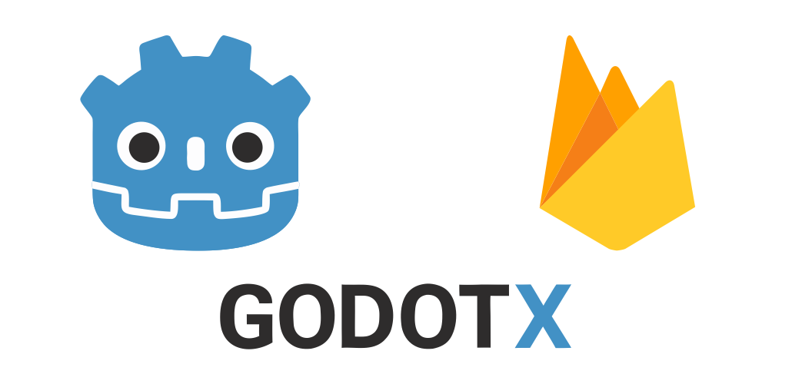
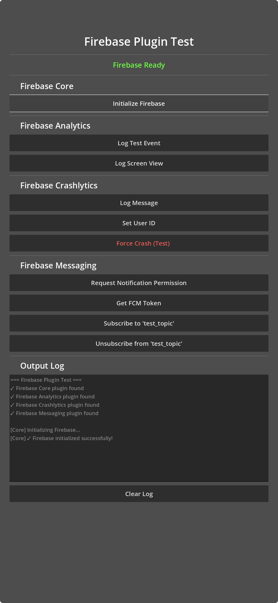

<p align="center">
    <a href="https://github.com/godot-x/revenuecat" target="_blank" rel="noopener noreferrer">
        
    </a>
</p>

# Godotx RevenueCat

Native RevenueCat integration for Godot Engine with full support for iOS and Android.

## Table of Contents

- [Overview](#overview)
- [Quick Start](#quick-start)
- [Usage Examples](#usage-examples)
- [Advanced Configuration](#advanced-configuration)
- [Building (For Developers)](#building-for-developers)
- [Project Structure](#project-structure)
- [Development Guide](#development-guide)
- [Troubleshooting](#troubleshooting)
- [API Reference](#api-reference)
- [FAQ](#faq)
- [Contributing](#contributing)
- [Screenshot](#screenshot)
- [License](#license)

## Overview

This project provides a native RevenueCat plugin for Godot, built as a fully integrated purchase and subscription management system using the official RevenueCat SDK. The plugin is shipped as native libraries for iOS (`.xcframework`) and Android (`.aar`) and automatically managed through the Godot Export Pipeline.

### Key Features

- 💰 **Purchases & Subscriptions** – Easily handle consumables, non‑consumables, and subscription products
- 🧩 **Entitlements & Customer Info** – Query whether a user is premium and access entitlement statuses
- 📦 **Offerings & Products** – Retrieve RevenueCat products dynamically and build custom paywalls
- 🧱 **Native Paywall UI** – Show RevenueCat UI using `present_paywall` (iOS + Android)
- 🔑 **User Authentication** – Login, logout, restore purchases and support cross‑platform accounts

### Version Information

| Component | Version |
|-----------|---------|
| Godot | 4.5‑stable |
| RevenueCat iOS SDK | 5.48.0 |
| RevenueCat Android SDK | 9.14.0 |
| Kotlin | 2.1.0 |
| Min iOS | 15.0 |
| Min Android SDK | 24 (Android 7.0) |

## Quick Start

### 1. Installation

Copy the plugin folder into your Godot project:

```
your_project/
└── addons/
    └── godotx_revenue_cat/
```

Enable it in the editor:

- Go to **Project → Project Settings → Plugins**
- Enable **Godotx RevenueCat**

### 2. Configure Export Preset

#### Android

1. Install Android Build Template  
   `Project → Install Android Build Template`

2. In the export menu, set:
   - ✔ **Use Gradle Build**
   - ✔ **Enable GodotxRevenueCat** in plugins list

#### iOS

Enable plugin under export → iOS plugins list.

## Usage Examples

### Initialization

```gdscript
extends Node

var revenuecat

func _ready():
    if Engine.has_singleton("GodotxRevenueCat"):
        revenuecat = Engine.get_singleton("GodotxRevenueCat")

        # Signals
        revenuecat.customer_info_changed.connect(_on_customer_info_changed)
        revenuecat.purchase_result.connect(_on_purchase_result)

        var api_key = OS.get_name() == "iOS" ? "appl_xxx" : "goog_xxx"
        revenuecat.initialize(api_key, "", true)

func _on_customer_info_changed(data):
    print("Customer info updated: ", data)

func _on_purchase_result(data):
    print("Purchase result: ", data)
```

### Fetching Products & Offerings

```gdscript
# Offerings
revenuecat.fetch_offerings()

# Products (for custom UI)
revenuecat.fetch_products(["premium_monthly", "premium_yearly"])
```

### Purchase Flow

```gdscript
revenuecat.purchase("premium_monthly")
```

### Show Native Paywall

```gdscript
revenuecat.present_paywall("default")
```

### Entitlements

```gdscript
revenuecat.is_subscriber()
revenuecat.has_entitlement("premium_access")
```

### Login & Logout

```gdscript
revenuecat.login("user_123")
revenuecat.logout()
```

## Building (For Developers)

```bash
make setup               # Downloads SDKs & prepares build
make build-all           # Builds everything
make build-apple         # Build only iOS
make build-android       # Build only Android
make clean               # Full cleanup
```

## Project Structure

```
revenuecat/
├── addons/godotx_revenue_cat/    # Godot plugin
│   ├── export_plugin.gd
│   └── plugin.cfg
│
├── source/                       # Native source
│   ├── ios/
│   └── android/
│
├── ios/plugins/                  # Built output (.xcframework)
├── android/                      # Built output (.aar)
└── scenes/Main.tscn              # Test scene
```

## API Reference

### Methods

| Method | Description |
|--------|-------------|
| `initialize(api_key, user_id, debug)` | Initializes SDK |
| `fetch_offerings()` | Retrieves offerings |
| `fetch_products(ids)` | Retrieves product details |
| `purchase(id)` | Starts purchase flow |
| `login(user_id)` | Authenticate user |
| `logout()` | Anonymous reset |
| `is_subscriber()` | Returns subscription state |
| `has_entitlement(id)` | Checks entitlement |
| `present_paywall(offering)` | Shows native UI |

### Signals

| Signal | Args | Description |
|--------|------|-------------|
| `customer_info_changed` | `data: Dictionary` | On customer update |
| `purchase_result` | `data: Dictionary` | On purchase finish |
| `offerings` | `data: Dictionary` | Offerings received |
| `products` | `items: Array` | Products received |
| `login_finished` | `data: Dictionary` | Login status |
| `logout_finished` | `data: Dictionary` | Logout |
| `subscriber` | `value: bool` | Subscription flag |
| `entitlement` | `id, active` | Entitlement result |
| `paywall_result` | `data: Dictionary` | Paywall close |

## FAQ

**Q: Do I need separate keys for Android/iOS?**  
Yes — use `appl_` for iOS and `goog_` for Android.

## Contributing

Contributions are welcome! Here's how you can help:

1. **Report bugs**: Open an issue with reproduction steps
2. **Request features**: Suggest new features or improvements
3. **Submit PRs**: 
   - Follow existing code style
   - Test on both iOS and Android
   - Update documentation as needed

### Project Conventions

- **iOS**: Objective-C++ for Godot integration
- **Android**: Kotlin for plugin implementation
- **Naming**: `GodotxRevenueCat` for singleton names
- **Signals**: Use snake_case (e.g., `purchase_result`, `initialized`)
- **Methods**: Use snake_case following GDScript conventions

## Screenshot



## License

MIT License - See [LICENSE](LICENSE)

## Support

- **Issues**: [GitHub Issues](https://github.com/paulocoutinhox/godot-revenuecat/issues)
- **Discussions**: [GitHub Discussions](https://github.com/paulocoutinhox/godot-revenuecat/discussions)

Made with ❤️ by [Paulo Coutinho](https://github.com/paulocoutinhox)
