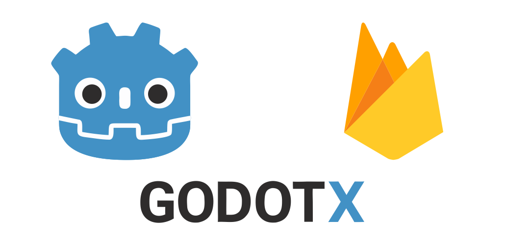
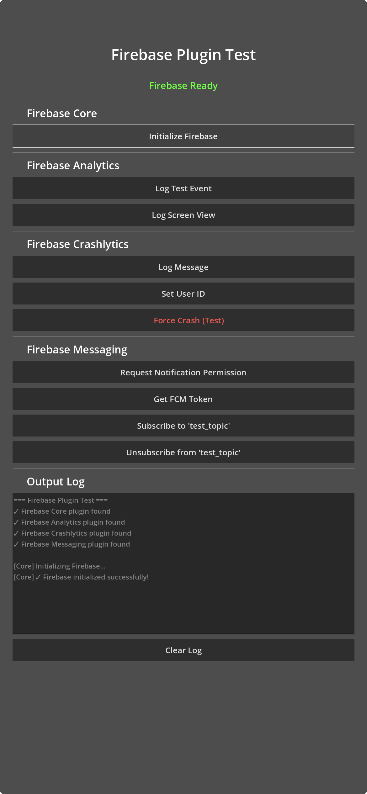

<p align="center">
    <a href="https://github.com/godot-x/firebase" target="_blank" rel="noopener noreferrer">
        
    </a>
</p>

# Godotx RevenueCat

Modular Firebase integration for Godot with support for iOS and Android.

## Table of Contents

- [Overview](#overview)
- [Quick Start](#quick-start)
- [Usage Examples](#usage-examples)
- [Advanced Configuration](#advanced-configuration)
- [Building (For Developers)](#building-for-developers)
- [Project Structure](#project-structure)
- [Development Guide](#development-guide)
- [Troubleshooting](#troubleshooting)
- [API Reference](#api-reference)
- [FAQ](#faq)
- [Contributing](#contributing)
- [Screenshot](#screenshot)
- [License](#license)

## Overview

This project provides native Firebase plugins for Godot, built as separate modules that can be enabled independently. Each Firebase service (Core, Analytics, Crashlytics, Messaging) is compiled as a native library for iOS (`.xcframework`) and Android (`.aar`), and bundled via a Godot EditorExportPlugin.

### Key Features

- 🔥 **Firebase Core** - Required base for all Firebase services
- 📊 **Firebase Analytics** - Event tracking and user analytics
- 🐛 **Firebase Crashlytics** - Crash reporting and diagnostics
- 💬 **Firebase Messaging** - Push notifications (FCM)

### Version Information

| Component | Version |
|-----------|---------|
| Godot | 4.5-stable |
| Firebase iOS SDK | 12.5.0 |
| Firebase Android SDK | 33.5.1 |
| Kotlin | 2.1.0 |
| Min iOS | 13.0 |
| Min Android SDK | 24 (Android 7.0) |

## Quick Start

### 1. Installation

1. **Copy the plugin** to your Godot project:
   ```
   your_project/
   └── addons/
       └── godotx_firebase/  # Copy this folder
   ```

2. **Enable the plugin** in Godot:
   - Open **Project → Project Settings → Plugins**
   - Enable "Godotx Firebase"

3. **Add Firebase config files** to your project root:
   - Download from [Firebase Console](https://console.firebase.google.com/)
   - iOS: `GoogleService-Info.plist`
   - Android: `google-services.json`

### 2. Configure Export Preset

**For Android:**
1. Install Android Build Template:
   - **Project → Install Android Build Template**

2. Configure export preset:
   - Enable **Use Gradle Build**
   - **Firebase/Android Config File**: Select `google-services.json`
   - Enable **Firebase Core** (required)
   - Enable other modules you need (Analytics, Crashlytics, Messaging)

**For iOS:**
1. Configure export preset:
   - **Firebase/iOS Config File**: Select `GoogleService-Info.plist`
   - Enable **Firebase Core** (required)
   - Enable other modules you need

### 3. Test the Integration

Run the included test scene to verify everything works:
```
scenes/Main.tscn
```

The test scene includes buttons to test all Firebase features.

## Usage Examples

### Firebase Core

```gdscript
extends Node

var firebase_core

func _ready():
    if Engine.has_singleton("GodotxFirebaseCore"):
        firebase_core = Engine.get_singleton("GodotxFirebaseCore")
        firebase_core.initialized.connect(_on_initialized)
        firebase_core.initialize()

func _on_initialized(success: bool):
    print("Firebase initialized: ", success)
```

### Firebase Analytics

```gdscript
var analytics = Engine.get_singleton("GodotxFirebaseAnalytics")

# Log event with parameters
var params = {"level": "5", "score": "1000"}
analytics.log_event("level_complete", JSON.stringify(params))
```

### Firebase Crashlytics

```gdscript
var crashlytics = Engine.get_singleton("GodotxFirebaseCrashlytics")

crashlytics.set_user_id("user_123")
crashlytics.log_message("Player entered level 5")
```

### Firebase Messaging

```gdscript
var messaging = Engine.get_singleton("GodotxFirebaseMessaging")

# Request notification permission (this also registers for APNs on iOS)
messaging.request_permission()

# Connect to signals
messaging.token_received.connect(_on_token_received)
messaging.apn_token_received.connect(_on_apn_token_received)  # iOS only

# Get FCM token
messaging.get_token()

# Get APNs token (iOS only - call after request_permission)
if OS.get_name() == "iOS":
    messaging.get_apns_token()

func _on_token_received(token: String):
    print("FCM Token: ", token)

func _on_apn_token_received(token: String):
    # iOS only - Apple Push Notification device token
    print("APN Token: ", token)
```

**Available Methods:**
- `request_permission()` - Request notification permission from user
- `get_token()` - Get FCM registration token
- `get_apns_token()` - Get APNs device token (iOS only, requires permission first)
- `subscribe_to_topic(topic: String)` - Subscribe to a topic
- `unsubscribe_from_topic(topic: String)` - Unsubscribe from a topic

**Available Signals:**
- `permission_granted()` - Notification permission granted
- `token_received(token: String)` - FCM registration token received
- `apn_token_received(token: String)` - iOS APN device token received (iOS only)
- `message_received(title: String, body: String)` - Push notification received
- `error(message: String)` - Error occurred

**Note:** On iOS, Firebase Messaging uses method swizzling to automatically handle APNs registration. The APNs token is captured by Firebase internally and can be accessed via the `get_apns_token()` method after calling `request_permission()`.

## Advanced Configuration

### Android Gradle Setup (Optional)

The plugin automatically handles Firebase dependencies, but if you need to customize your Android build:

1. Edit `android/build/build.gradle`:
```gradle
buildscript {
    dependencies {
        // Add if not present
        classpath 'com.google.gms:google-services:4.4.2'
        
        // Add this if using Crashlytics (required for crash reports)
        classpath 'com.google.firebase:firebase-crashlytics-gradle:3.0.6'
    }
}

// At the end of the file
apply plugin: 'com.google.gms.google-services'

// Add this if using Crashlytics
apply plugin: 'com.google.firebase.crashlytics'
```

2. Custom dependencies can be added to module-specific `build.gradle` files

### Android Notification Icon

To customize the notification icon for Firebase Cloud Messaging, see:

📄 **[Android Notification Icon Customization Guide](docs/android-notification-icon.md)**

### iOS Push Notifications Setup

Firebase Messaging on iOS requires Push Notifications capability to be enabled. The plugin automatically configures this when you enable Firebase Messaging in the export preset.

### iOS Framework Dependencies

All Firebase frameworks are automatically bundled by the export plugin. The plugin uses the `.gdip` files to declare dependencies and ensures all required `.xcframework` files are included in the export.

## Building (For Developers)

### Requirements

- macOS with Xcode 14+
- [XcodeGen](https://github.com/yonaskolb/XcodeGen): `brew install xcodegen`
- [CocoaPods](https://cocoapods.org): `sudo gem install cocoapods`
- Android SDK & Gradle
- Godot source (auto-downloaded by make)

### Build Commands

```bash
# Initial setup (run once)
make setup-godot        # Clone Godot source code
make setup-firebase     # Download Firebase iOS SDK (v12.5.0)
make unsign-firebase    # Remove code signatures (prevents build errors)
make setup-apple        # Generate Xcode projects + install CocoaPods

# Build everything
make build-all          # Build iOS + Android (both Debug & Release)

# Or build platforms separately
make build-apple        # Build iOS .xcframework files
make build-android      # Build Android .aar files

# Maintenance commands
make clean              # Clean all build artifacts
make clean-firebase     # Remove Firebase SDK (re-run setup-firebase after)
make clean-godot        # Remove Godot source (re-run setup-godot after)

# Show all available commands
make help
```

### Build Output Structure

After running `make build-all`, you'll get:

**iOS Plugins** (`ios/plugins/`):
```
ios/plugins/
├── firebase_core/
│   ├── GodotxFirebaseCore.debug.xcframework       # Your plugin (Debug)
│   ├── GodotxFirebaseCore.release.xcframework     # Your plugin (Release)
│   ├── FirebaseCore.xcframework                   # Firebase SDK
│   ├── FirebaseAnalytics.xcframework
│   ├── FBLPromises.xcframework
│   ├── GoogleUtilities.xcframework
│   ├── nanopb.xcframework
│   └── firebase_core.gdip                         # Plugin descriptor
├── firebase_analytics/
├── firebase_crashlytics/
└── firebase_messaging/
```

**Android Plugins** (`android/`):
```
android/
├── firebase_core/
│   ├── firebase_core.debug.aar                    # Debug variant
│   └── firebase_core.release.aar                  # Release variant
├── firebase_analytics/
├── firebase_crashlytics/
└── firebase_messaging/
```

Each `.aar` file contains:
- Compiled Kotlin code
- Firebase SDK dependencies (via Gradle)
- Android manifest with plugin metadata

## Project Structure

```
firebase/
├── addons/
│   └── godotx_firebase/           # ✨ Godot plugin (copy to your project)
│       ├── export_plugin.gd       # Export configuration & module bundling
│       └── plugin.cfg
│
├── source/                        # 🛠️ Source code for all plugins
│   ├── ios/
│   │   ├── firebase_sdk/          # Firebase iOS SDK (downloaded)
│   │   ├── firebase_core/
│   │   │   ├── Sources/           # C++/Objective-C++ code
│   │   │   ├── project.yml        # XcodeGen configuration
│   │   │   ├── Podfile            # CocoaPods dependencies
│   │   │   └── *.gdip             # Godot plugin definition
│   │   ├── firebase_analytics/
│   │   ├── firebase_crashlytics/
│   │   └── firebase_messaging/
│   │
│   └── android/
│       ├── firebase_core/
│       │   ├── src/main/java/     # Kotlin source code
│       │   ├── build.gradle.kts   # Gradle build configuration
│       │   └── gradlew            # Gradle wrapper
│       ├── firebase_analytics/
│       ├── firebase_crashlytics/
│       └── firebase_messaging/
│
├── ios/
│   └── plugins/                   # 📦 Built iOS plugins
│       ├── firebase_core/
│       │   ├── GodotxFirebaseCore.{debug|release}.xcframework
│       │   ├── FirebaseCore.xcframework
│       │   ├── firebase_core.gdip
│       │   └── ... (Firebase dependencies)
│       ├── firebase_analytics/
│       ├── firebase_crashlytics/
│       └── firebase_messaging/
│
├── android/                       # 📦 Built Android plugins
│   ├── firebase_core/
│   │   ├── firebase_core.debug.aar
│   │   └── firebase_core.release.aar
│   ├── firebase_analytics/
│   ├── firebase_crashlytics/
│   └── firebase_messaging/
│
├── godot/                         # Godot engine source (cloned by make)
├── godot-cpp/                     # Godot C++ bindings (if needed)
└── scenes/Main.tscn               # 🧪 Test scene with UI buttons
```

## Development Guide

### How It Works

1. **Source Code** (`source/`): Platform-specific implementations
   - **iOS**: Objective-C++ wrappers around Firebase C++ SDK
   - **Android**: Kotlin wrappers using Firebase Android SDK
   
2. **Build Process**: 
   - **iOS**: XcodeGen generates Xcode projects → builds static libraries → creates XCFrameworks
   - **Android**: Gradle builds AAR files with embedded Firebase dependencies
   
3. **Plugin Integration** (`addons/godotx_firebase/`):
   - `export_plugin.gd` detects enabled modules in export presets
   - Automatically bundles `.xcframework` (iOS) or `.aar` (Android) files
   - Copies Firebase configuration files to builds

### Adding a New Firebase Module

1. Create source directories:
   ```bash
   mkdir -p source/ios/firebase_newmodule/Sources
   mkdir -p source/android/firebase_newmodule/src/main/java
   ```

2. Implement platform code:
   - iOS: Create `.h`/`.mm` files + `project.yml` + `Podfile` + `.gdip`
   - Android: Create Kotlin plugin + `build.gradle.kts` + `AndroidManifest.xml`

3. Update `Makefile`:
   - Add module to `APPLE_MODULES` and `ANDROID_MODULES`
   - Add corresponding module name to `APPLE_MODULE_NAMES`

4. Update `export_plugin.gd`:
   - Add checkbox for new module in `_get_export_options()`
   - Add bundling logic in platform-specific sections

5. Build and test:
   ```bash
   make clean
   make build-all
   ```

## Troubleshooting

### Build Issues

**"Firebase SDK not found" during iOS build**
```bash
make setup-firebase
make unsign-firebase
```

**Xcode code signing errors**
```bash
# Remove signatures
make unsign-firebase
```

**Gradle build fails with version conflicts**
- Check `build.gradle.kts` versions match Firebase BOM
- Clean Android build: `cd source/android/firebase_* && ./gradlew clean`

### Runtime Issues

**Android: Plugin not found**
- Verify `AndroidManifest.xml` uses `org.godotengine.plugin.v2.` prefix
- Check methods have `@UsedByGodot` annotation
- Enable **Use Gradle Build** in Android export preset
- Rebuild: `make build-android`

**iOS: Frameworks not found**
- Clean and rebuild: `make clean && make build-apple`
- Check `ios/plugins/firebase_*/` contains `.xcframework` files
- Verify export preset has Firebase modules enabled

**Firebase not initializing**
- Ensure **Firebase Core** is enabled first (required for all modules)
- Check config files are selected in export settings:
  - iOS: `GoogleService-Info.plist`
  - Android: `google-services.json`
- Verify config files exist in project root
- Check console for initialization errors

**Kotlin version errors (Android)**
- Project uses Kotlin 2.1.0 (matches Firebase SDK 33.5.1)
- Update `build.gradle.kts` if using different Godot version

## API Reference

All plugins follow the same pattern:

```gdscript
# Get singleton
var plugin = Engine.get_singleton("GodotxFirebase<Component>")

# Connect signals
plugin.signal_name.connect(callback)

# Call methods
plugin.method_name(parameters)
```

### Available Singletons

- `GodotxFirebaseCore` - Firebase initialization and configuration
- `GodotxFirebaseAnalytics` - Event tracking and user properties
- `GodotxFirebaseCrashlytics` - Crash reporting and custom logs
- `GodotxFirebaseMessaging` - Push notifications and FCM tokens

## FAQ

**Q: Do I need to build the plugins myself?**  
A: No, if you just want to use the plugins. The pre-built `.xcframework` and `.aar` files are included in the repository. Building is only needed if you want to modify the source code or add new features.

**Q: Can I use only some Firebase modules?**  
A: Yes! Each module can be enabled/disabled independently in the export preset. However, **Firebase Core is always required** as it provides the base functionality.

**Q: Will this increase my app size?**  
A: Yes, Firebase adds approximately:
- **iOS**: 15-20 MB per module (compressed)
- **Android**: 5-10 MB per module (compressed)

Only enabled modules are included in the final build.

**Q: Does this work with Godot 4.4 or earlier?**  
A: This project is built for Godot 4.5 or later.

**Q: How do I get Firebase config files?**  
A: 
1. Go to [Firebase Console](https://console.firebase.google.com/)
2. Create a project (or select existing)
3. Add iOS/Android app
4. Download `GoogleService-Info.plist` (iOS) or `google-services.json` (Android)

**Q: Why do I need to unsign Firebase frameworks?**  
A: Firebase's pre-signed frameworks can cause code signing conflicts during Xcode builds. Running `make unsign-firebase` removes these signatures, allowing Xcode to sign everything together.

## Contributing

Contributions are welcome! Here's how you can help:

1. **Report bugs**: Open an issue with reproduction steps
2. **Request features**: Suggest new Firebase modules or improvements
3. **Submit PRs**: 
   - Follow existing code style
   - Test on both iOS and Android
   - Update documentation as needed

### Project Conventions

- **iOS**: Objective-C++ for Godot integration
- **Android**: Kotlin for plugin implementation
- **Naming**: `GodotxFirebase{Module}` for singleton names
- **Signals**: Use snake_case (e.g., `token_received`, `initialized`)
- **Methods**: Use snake_case following GDScript conventions

## Screenshot



## License

MIT License - See [LICENSE](LICENSE)

## Support

- **Issues**: [GitHub Issues](https://github.com/paulocoutinhox/godot-firebase/issues)
- **Discussions**: [GitHub Discussions](https://github.com/paulocoutinhox/godot-firebase/discussions)

Made with ❤️ by [Paulo Coutinho](https://github.com/paulocoutinhox)
