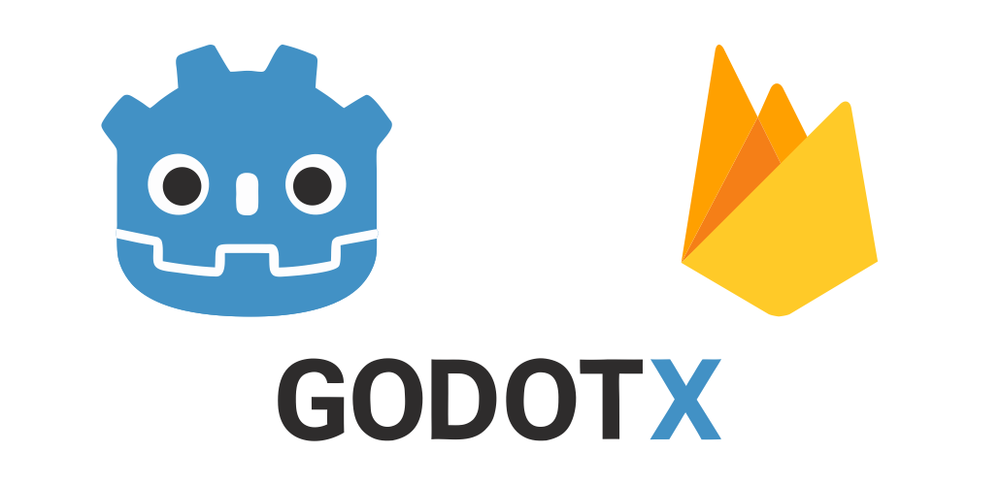
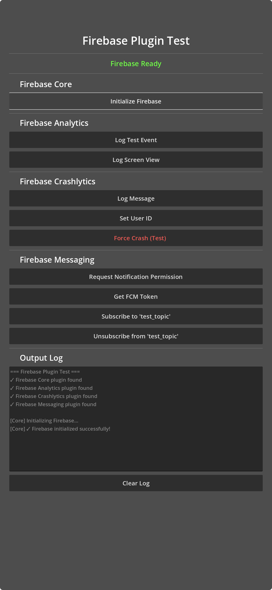

<p align="center">
    <a href="https://github.com/godot-x/revenuecat" target="_blank" rel="noopener noreferrer">
        
    </a>
</p>

# Godotx RevenueCat

Native RevenueCat integration for Godot Engine with full support for iOS and Android.

## Table of Contents

- [Overview](#overview)
- [Quick Start](#quick-start)
- [Usage Examples](#usage-examples)
- [Advanced Configuration](#advanced-configuration)
- [Building (For Developers)](#building-for-developers)
- [Project Structure](#project-structure)
- [Development Guide](#development-guide)
- [Troubleshooting](#troubleshooting)
- [API Reference](#api-reference)
- [FAQ](#faq)
- [Contributing](#contributing)
- [Screenshot](#screenshot)
- [License](#license)

## Overview

This project provides a native RevenueCat plugin for Godot, built as a fully integrated purchase and subscription management system using the official RevenueCat SDK. The plugin is shipped as native libraries for iOS (`.xcframework`) and Android (`.aar`) and automatically managed through the Godot Export Pipeline.

### Key Features

- 💰 **Purchases & Subscriptions** – Easily handle consumables, non‑consumables, and subscription products
- 🧩 **Entitlements & Customer Info** – Query whether a user is premium and access entitlement statuses
- 📦 **Offerings & Products** – Retrieve RevenueCat products dynamically and build custom paywalls
- 🧱 **Native Paywall UI** – Show RevenueCat UI using `present_paywall` (iOS + Android)
- 🔑 **User Authentication** – Login, logout, restore purchases and support cross‑platform accounts

### Version Information

| Component | Version |
|-----------|---------|
| Godot | 4.7‑stable |
| RevenueCat iOS SDK | 5.81.1 |
| RevenueCat Android SDK | 10.14.1 |
| Kotlin | 2.4.10 |
| Min iOS | 15.0 |
| Min Android SDK | 24 (Android 7.0) |

## Quick Start

### 1. Installation

#### Option A: Godot Asset Library (Recommended)

1. Open **AssetLib** in Godot Editor
2. Search for "Godotx RevenueCat"
3. Click **Download** and **Install**
4. Or download directly from: https://godotengine.org/asset-library/asset/4493

#### Option B: Manual Installation

1. **Download the ZIP** from [Releases](https://github.com/godot-x/revenuecat/releases)

2. **Extract the ZIP** - it contains 3 folders:
   ```
   godotx_revenuecat/
   ├── addons/
   ├── ios/
   └── android/
   ```

3. **Copy all 3 folders** to your Godot project root:
   ```
   your_project/
   ├── addons/
   │   └── godotx_revenue_cat/
   ├── ios/
   │   └── plugins/
   │       └── revenuecat/
   └── android/
       └── revenuecat/
   ```

4. **Enable the plugin** in Godot:
   - Open **Project → Project Settings → Plugins**
   - Enable "Godotx RevenueCat"

### 2. Configure Export Preset

#### Android

1. Install Android Build Template  
   `Project → Install Android Build Template`

2. In the export menu, set:
   - ✔ **Use Gradle Build**
   - ✔ **Enable GodotxRevenueCat** in plugins list

#### iOS

Enable plugin under export → iOS plugins list.

## Usage Examples

### Initialization

```gdscript
extends Node

var revenuecat

func _ready():
    if Engine.has_singleton("GodotxRevenueCat"):
        revenuecat = Engine.get_singleton("GodotxRevenueCat")

        # Signals
        revenuecat.customer_info_changed.connect(_on_customer_info_changed)
        revenuecat.purchase_result.connect(_on_purchase_result)

        var api_key = OS.get_name() == "iOS" ? "appl_xxx" : "goog_xxx"
        revenuecat.initialize(api_key, "", true)

func _on_customer_info_changed(data):
    print("Customer info updated: ", data)

func _on_purchase_result(data):
    print("Purchase result: ", data)
```

### Fetching Products & Offerings

```gdscript
# Offerings
revenuecat.offerings.connect(_on_offerings_received)
revenuecat.fetch_offerings()

func _on_offerings_received(data: Dictionary):
    var error = data.get("error", "")
    if error != "":
        print("Error: ", error)
        return

    # The current offering's identifier, and its packages ready to display.
    print("Current offering: ", data["identifier"])

    for pkg in data["packages"]:
        var product = pkg["product"]
        print("Package: ", pkg["identifier"], " (", pkg["package_type"], ")")
        print("  ", product["title"], " - ", product["price"])

    # Every offering, including the current one.
    for offering in data["offerings"]:
        print(offering["identifier"], " has ", offering["packages"].size(), " packages")
```

The `offerings` signal carries the same keys and the same Godot types on iOS and Android:

| Key | Type | Notes |
|-----|------|-------|
| `error` | `String` | `""` when the fetch succeeded |
| `identifier` | `String` | The current offering's identifier, `""` if there is none |
| `packages` | `Array` | The current offering's packages, `[]` if there is none |
| `offerings` | `Array` | Every offering: `{ "identifier": String, "packages": Array }` |

Each entry of a `packages` array is a `Dictionary`:

| Key | Type | Example |
|-----|------|---------|
| `identifier` | `String` | `"$rc_monthly"` |
| `package_type` | `String` | `"MONTHLY"`, `"ANNUAL"`, `"SIX_MONTH"`, `"THREE_MONTH"`, `"TWO_MONTH"`, `"WEEKLY"`, `"LIFETIME"`, `"CUSTOM"`, `"UNKNOWN"` |
| `product` | `Dictionary` | The underlying store product |

Each `product` uses the same keys as `fetch_products`, plus `currency`:

| Key | Type | Example |
|-----|------|---------|
| `id` | `String` | `"premium_monthly"` |
| `title` | `String` | `"Premium"` |
| `description` | `String` | `"Unlock everything"` |
| `price` | `String` | `"$4.99"` (localized) |
| `amount` | `float` | `4.99` |
| `currency` | `String` | `"USD"` |

```gdscript
# Products (for custom UI)
revenuecat.products.connect(_on_products_received)
revenuecat.fetch_products(["premium_monthly", "premium_yearly"])

func _on_products_received(data: Dictionary):
    var error = data.get("error", "")
    if error != "":
        print("Error: ", error)
        return
    
    var raw_products = data.get("products", null)
    if raw_products == null:
        return
    
    var products_list: Array = []
    
    # ios - native array
    if raw_products is Array:
        products_list = raw_products
    
    # android - array list
    elif raw_products is JavaObject:
        var count: int = raw_products.call("size")
        for i in range(count):
            products_list.append(raw_products.call("get", i))
    
    # process products
    for product in products_list:
        print("ID: ", product["id"])
        print("Title: ", product["title"])
        print("Price: ", product["price"])
```

### Purchases Flows

```gdscript
revenuecat.purchase("premium_monthly")
```

Purchase a package from an offering instead of a bare product id. Pass `""` as the offering id to
use the current offering. This is the only way to buy a Google Play subscription that has more than
one base plan, because the `Package` carries the base plan and a product id cannot.

```gdscript
revenuecat.purchase_package("", "$rc_monthly")
revenuecat.purchase_package("default", "$rc_annual")
```

Both paths emit the same `purchase_result` dictionary, so a single handler serves both. On failure
`error` is one of the SDK's own messages or `offering_not_found`, `package_not_found`, or
`activity_null` (Android only, as with `purchase`).

```gdscript
revenuecat.restore_finished.connect(_on_restore_finished)
revenuecat.restore_purchases()

func _on_restore_finished(data: Dictionary):
    if not data["success"]:
        print("Restore failed: ", data["error"])
        return

    if data["restored"]:
        print("Restored ", data["active_entitlements"], " entitlements")
    else:
        print("Nothing to restore")
```

`restore_finished` always fires — once, on success and on failure alike — and carries the same keys
and the same Godot types on iOS and Android:

| Key | Type | Notes |
|-----|------|-------|
| `success` | `bool` | `false` only when the restore itself failed |
| `restored` | `bool` | `true` when at least one entitlement is active afterwards |
| `active_entitlements` | `int` | Count of active entitlements, `0` on failure |
| `error` | `String` | The SDK's own message, `""` on success |

### Show Native Paywall

```gdscript
revenuecat.present_paywall("default")
```

### Entitlements

```gdscript
revenuecat.is_subscriber()
revenuecat.has_entitlement("premium_access")
revenuecat.check_entitlement("premium_access")
```

### Customer Info

```gdscript
revenuecat.customer_info_changed.connect(_on_customer_info_changed)
revenuecat.get_customer_info()

func _on_customer_info_changed(data: Dictionary):
    if "premium_access" in data["active_ids"]:
        print("Premium is active")
    else:
        print("Premium is not active")
```

`customer_info` (the reply to `get_customer_info()`) and `customer_info_changed` (emitted whenever
RevenueCat updates the entitlements: a renewal, an expiry, a restore, or a purchase made on another
device) carry the same keys and the same Godot types on iOS and Android:

| Key | Type | Notes |
|-----|------|-------|
| `active_entitlements` | `int` | Count of active entitlements, `0` if there are none |
| `active_ids` | `PackedStringArray` | The active entitlements' identifiers, `[]` if there are none |

Use `active_ids` to gate on a specific entitlement, and `active_entitlements` only when a count is
all you need. When a `get_customer_info()` fetch fails, `customer_info` carries an `error` key with
the SDK's own message.

### Login & Logout

```gdscript
revenuecat.login("user_123")
revenuecat.logout()
```

### Subscriber Attributes

```gdscript
revenuecat.set_attributes({
    "$email": "player@example.com",
    "favorite_mode": "endless",
})
```

RevenueCat subscriber attributes are string keys with string values, so only entries whose key and
value are both a `String` are forwarded. Any other entry is ignored, on iOS and Android alike.

## Advanced Configuration

### Android R8/ProGuard Minification

By default, R8 minification is **disabled** in release builds. If you want to enable it for smaller APK/AAB sizes, follow these steps:

1. **Edit `android/build/build.gradle`** and enable minification in the release build type:

   ```gradle
   android {
       buildTypes {
           release {
               minifyEnabled true
               shrinkResources true
               proguardFiles getDefaultProguardFile('proguard-android-optimize.txt'), 'proguard-rules.pro'
           }
       }
   }
   ```

2. **Create `android/build/proguard-rules.pro`** with the following content:

   ```proguard
   ####################################
   # Godot JNI
   ####################################
   -keep class org.godotengine.godot.** { *; }
   -dontwarn org.godotengine.godot.**
   ```

**Important Notes:**
- RevenueCat ProGuard rules are already included in the module (via `consumerProguardFiles`)
- Only add custom rules if you encounter issues with other libraries
- Test thoroughly after enabling minification to ensure everything works correctly

## Building (For Developers)

```bash
make setup               # Downloads SDKs & prepares build
make build-all           # Builds everything
make build-apple         # Build only iOS
make build-android       # Build only Android
make clean               # Full cleanup
```

## Project Structure

```
revenuecat/
├── addons/godotx_revenue_cat/    # Godot plugin
│   ├── export_plugin.gd
│   └── plugin.cfg
│
├── source/                       # Native source
│   ├── ios/
│   └── android/
│
├── ios/plugins/                  # Built output (.xcframework)
├── android/                      # Built output (.aar)
└── scenes/Main.tscn              # Test scene
```

## API Reference

### Methods

| Method | Description |
|--------|-------------|
| `initialize(api_key, user_id, debug)` | Initializes SDK |
| `get_customer_info()` | Requests the current customer info |
| `fetch_offerings()` | Retrieves offerings |
| `fetch_products(ids)` | Retrieves product details |
| `purchase(id)` | Starts purchase flow |
| `purchase_package(offering_id, package_id)` | Starts purchase flow for a package (`offering_id` `""` = current offering) |
| `login(user_id)` | Authenticate user |
| `logout()` | Anonymous reset |
| `is_subscriber()` | Returns subscription state |
| `has_entitlement(id)` | Returns if has entitlement |
| `present_paywall(offering)` | Shows native UI |
| `check_entitlement(id)` | Checks entitlement |
| `restore_purchases` | Retrieves purchases |
| `set_attributes(attributes)` | Sets subscriber attributes (string keys and string values only) |

### Signals

| Signal | Args | Description |
|--------|------|-------------|
| `customer_info_changed` | `data: Dictionary` | On customer update |
| `customer_info` | `data: Dictionary` | Customer info fetch result |
| `purchase_result` | `data: Dictionary` | On purchase finish |
| `offerings` | `data: Dictionary` | Offerings received |
| `products` | `data: Dictionary` | Products received |
| `login_finished` | `data: Dictionary` | Login status |
| `logout_finished` | `data: Dictionary` | Logout |
| `subscriber` | `value: bool` | Subscription flag |
| `entitlement` | `id, active` | Entitlement result |
| `paywall_result` | `data: Dictionary` | Paywall close |
| `restore_finished` | `data: Dictionary` | Restore result |

## FAQ

**Q: Do I need separate keys for Android/iOS?**  
Yes — use `appl_` for iOS and `goog_` for Android.

## Contributing

Contributions are welcome! Here's how you can help:

1. **Report bugs**: Open an issue with reproduction steps
2. **Request features**: Suggest new features or improvements
3. **Submit PRs**: 
   - Follow existing code style
   - Test on both iOS and Android
   - Update documentation as needed

### Project Conventions

- **iOS**: Objective-C++ for Godot integration
- **Android**: Kotlin for plugin implementation
- **Naming**: `GodotxRevenueCat` for singleton names
- **Signals**: Use snake_case (e.g., `purchase_result`, `initialized`)
- **Methods**: Use snake_case following GDScript conventions

## Screenshot



## License

MIT License - See [LICENSE](LICENSE)

## Support

- **Issues**: [GitHub Issues](https://github.com/paulocoutinhox/godot-revenuecat/issues)
- **Discussions**: [GitHub Discussions](https://github.com/paulocoutinhox/godot-revenuecat/discussions)

Made with ❤️ by [Paulo Coutinho](https://github.com/paulocoutinhox)
